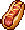
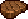
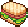
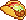
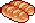
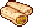
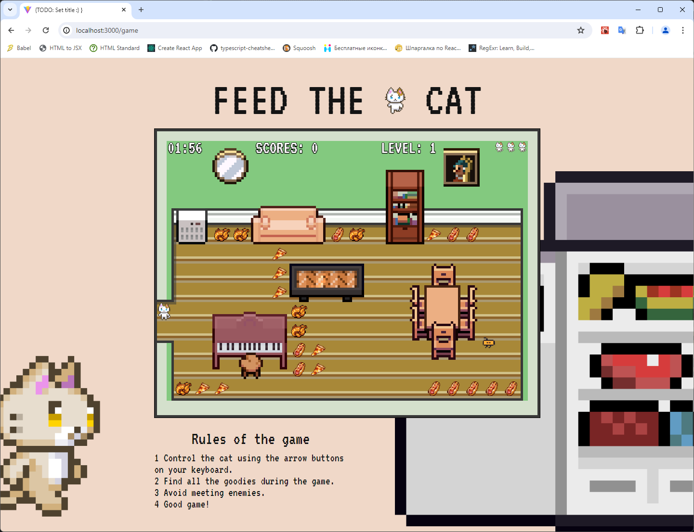
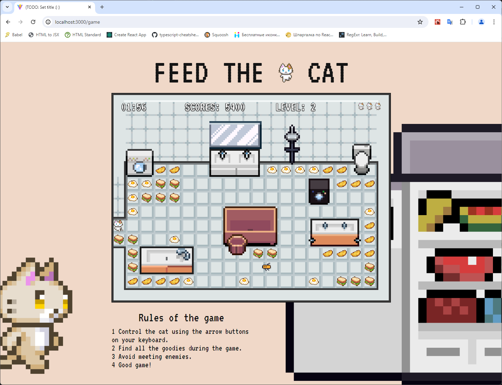
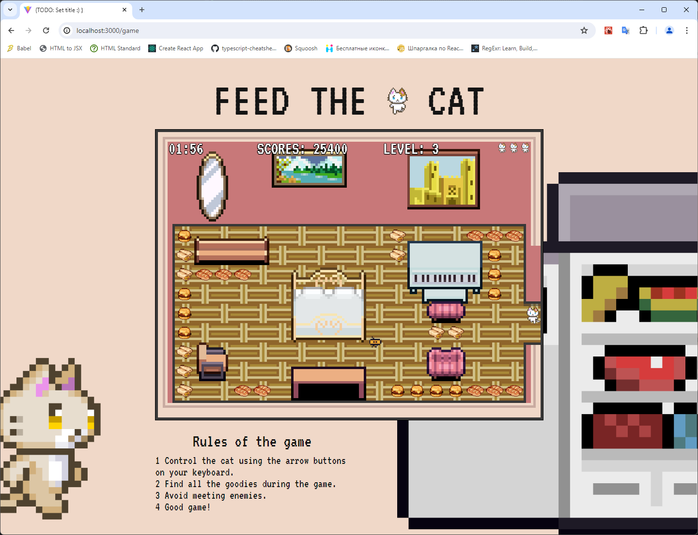
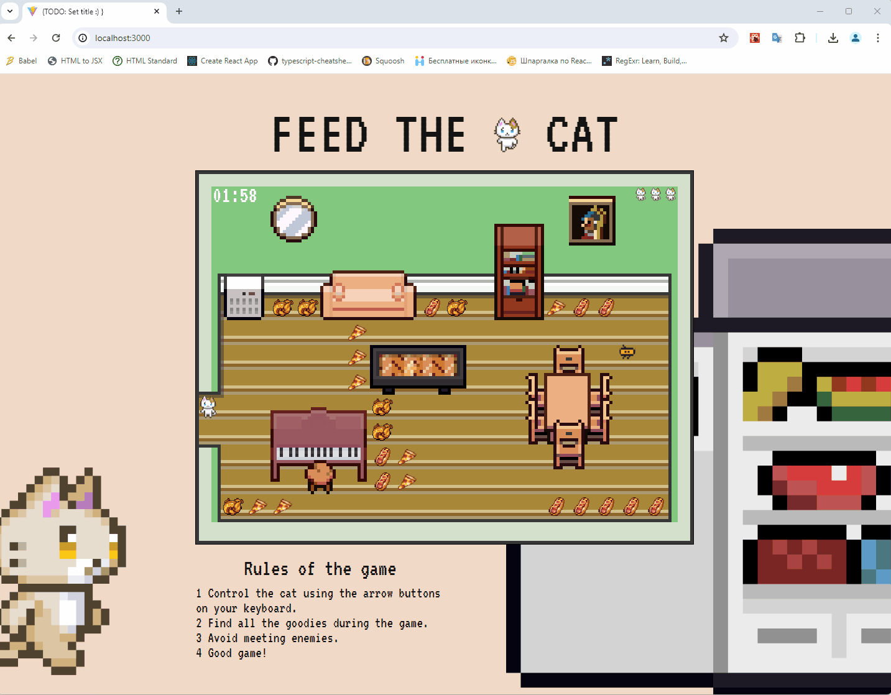

# Сценарий игры <!-- omit in toc -->

Игрок управляет котом , который двигается влево, вправо, вверх или вниз.
Цель игры: собрать всю еду на уровне за определённое время, время игры ограничено. Игрок должен уклоняться от врагов, которые движутся по определённой траектории. За столкновение с врагом у игрока сгорает одна жизнь. Всего у игрока 3 жизни. Игрок побеждает, если он собрал всю еду на уровне и не истратил все жизни.
В игре три уровня.

В начале игры можно выбрать несколько вариантов внешнего вида кота:

|           Персонаж           | Описание         |
|:----------------------------:|:-----------------|
|  | Белый кот        |
|  | Серый кот        |
|   | Рыжий кот        |
|   | Кошка |
|   | Бело-рыжий кот   |

В начале каждого уровня игрок появляется на карте уровня. Он должен собрать всю еду на уровне. За каждую найденную единицу еды игроку начисляются очки. После сбора обычной еды появляется дополнительная еда. За неё игрок получает больше очков.

На каждом уровне своя еда:

**Еда на уровне 1:**

|                 Еда                 | Описание                                      |
|:-----------------------------------:|:----------------------------------------------|
|             Обычная еда             ||
|      | Курица. За неё игрок получает 100 очков.      |
|       | Хотдог. За него игрок получает 200 очков.     |
|         | Пицца. За неё игрок получает 300 очков.       |
|         Дополнительная еда          ||
|         | Стейк. За него игрок получает 400 очков.      |

**Еда на уровне 2:**

|                  Еда                  | Описание                                    |
|:-----------------------------------:|:----------------------------------------------|
|             Обычная еда             ||
|      | Яичница. За неё игрок получает 200 очков.   |
|           | Омлет. За него игрок получает 400 очков.    |
|      | Сэндвич. За него игрок получает 600 очков.  |
|         Дополнительная еда          ||
|             | Тако. За него игрок получает 800 очков.     |


**Еда на уровне 3:**

|                  Еда                  | Описание                                    |
|:-----------------------------------:|:----------------------------------------------|
|             Обычная еда             ||
|            | Хлеб. За него игрок получает 300 очков.     |
|         | Бургер. За него игрок получает 600 очков.   |
|       | Буррито. За него игрок получает 900 очков.  |
|         Дополнительная еда          ||
|    | Чизкейк. За него игрок получает 1200 очков. |

_TODO:_

- [x] Добавить другие уровни в виде комнат дома.
- [x] Найти другие изображения еды.
- [x] Добавить несколько вариантов внешнего вида кота.

_Хотелки:_

- [x] Реализовать после сбора всей еды на уровне появление дополнительной еды, которая даёт больше очков.

## Скриншоты игры

## Уровень 1 - Гостиная


## Уровень 2 - Ванная


## Уровень 3 - Спальня


## Игровое видео:


### Как запускать?

1. Убедитесь что у вас установлен `node` и `docker`
2. Выполните команду `yarn bootstrap` - это обязательный шаг, без него ничего работать не будет :)
3. Выполните команду `yarn dev`
3. Выполните команду `yarn dev --scope=client` чтобы запустить только клиент
4. Выполните команду `yarn dev --scope=server` чтобы запустить только server


### Как добавить зависимости?
В этом проекте используется `monorepo` на основе [`lerna`](https://github.com/lerna/lerna)

Чтобы добавить зависимость для клиента 
```yarn lerna add {your_dep} --scope client```

Для сервера
```yarn lerna add {your_dep} --scope server```

И для клиента и для сервера
```yarn lerna add {your_dep}```


Если вы хотите добавить dev зависимость, проделайте то же самое, но с флагом `dev`
```yarn lerna add {your_dep} --dev --scope server```


### Тесты

Для клиента используется [`react-testing-library`](https://testing-library.com/docs/react-testing-library/intro/)

```yarn test```

### Линтинг

```yarn lint```

### Форматирование prettier

```yarn format```

### Production build

```yarn build```

И чтобы посмотреть что получилось


`yarn preview --scope client`
`yarn preview --scope server`

## Хуки
В проекте используется [lefthook](https://github.com/evilmartians/lefthook)
Если очень-очень нужно пропустить проверки, используйте `--no-verify` (но не злоупотребляйте :)

## Ой, ничего не работает :(

Откройте issue, я приду :)

## Автодеплой статики на vercel
Зарегистрируйте аккаунт на [vercel](https://vercel.com/)
Следуйте [инструкции](https://vitejs.dev/guide/static-deploy.html#vercel-for-git)
В качестве `root directory` укажите `packages/client`

Все ваши PR будут автоматически деплоиться на vercel. URL вам предоставит деплоящий бот

## Production окружение в докере
Перед первым запуском выполните `node init.js`


`docker compose up` - запустит три сервиса
1. nginx, раздающий клиентскую статику (client)
2. node, ваш сервер (server)
3. postgres, вашу базу данных (postgres)

Если вам понадобится только один сервис, просто уточните какой в команде
`docker compose up {sevice_name}`, например `docker compose up server`
